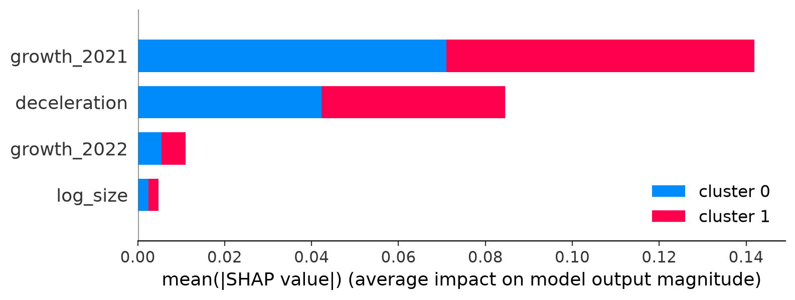

# Methodology

## Reproducibility

Everything on the [Analysis](analysis.md) page is generated by one command:

```bash
svod analyze "data/Dataxis_Test 2026.xlsx"
```

The pipeline (`svod` package: `load_panel → qc_report → market_summary / concentration / actor_features → cluster_actors → shap_summary → charts → typst PDF`) is unit-tested against a synthetic fixture; see the [API reference](reference/api.md).

## Data governance

The raw Dataxis dataset is **excluded from this public repository** (gitignored). Only derived aggregates — market totals, concentration indices, segment assignments and net-adds — are published here.

## Data quality

The quarterly panel comprises 951 rows across 131 actors and 8 quarters (2021Q1–2022Q4), with 0 duplicate rows and 0 nulls. Of the 131 actors, 105 have full coverage across all 8 quarters and are used for clustering; the remaining 26 either launched or exited mid-window (partial coverage) or have non-finite growth values, and are reported separately rather than forced into a segment.

## Metric definitions

- **HHI** — sum of squared subscriber shares × 10,000 (antitrust convention; >2,500 = highly concentrated).
- **CR4 / CR8** — combined subscriber share of the top 4 / 8 platforms.
- **Growth features** — per-actor 2021 growth (2021Q1→Q4), 2022 growth (2021Q4→2022Q4), deceleration = growth_2022 − growth_2021 (negative values = slowdown), log10 size. Growth winsorized to [-1, 2] so small-base outliers don't dominate.

## Segmentation

K-means on standardized features; k chosen by silhouette score (k=2, silhouette 0.64). Only fully-observed actors are clustered (105 of 131); partial actors are reported separately. No forecasting is attempted — eight quarterly observations per actor cannot support it.

## Segment interpretability (SHAP)

Clusters are unsupervised, so we validate their interpretability with a surrogate model: a random-forest classifier is trained to predict cluster membership from the clustering features, and SHAP values on the surrogate show which features define each segment. (Random forest rather than gradient boosting: mature multiclass support in `shap.TreeExplainer`.)



The chart shows mean absolute SHAP value per feature, stacked by cluster. `growth_2021` and `deceleration` dominate (roughly 0.14 and 0.085 combined mean |SHAP|), while `growth_2022` and `log_size` contribute little — segment membership is driven by 2021 growth rate and its change into 2022, not by platform size.

